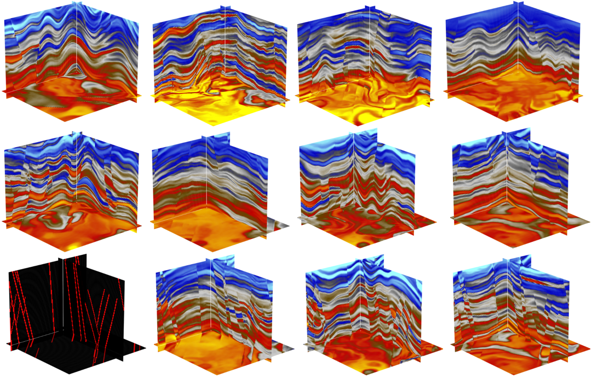

<div align="center">

# 🌍 GeoVolDiff
**Latent Diffusion Models for 3D Geological Seismic Volume Synthesis**

[](LICENSE) [](https://www.python.org/) [](https://huggingface.co/) [](TODO) [](https://github.com/huggingface/diffusers)



</div>
 
---

**GeoVolDiff** is a latent diffusion model (LDM) for synthesizing realistic 3D geological seismic volumes. Built on top of [HuggingFace Diffusers](https://github.com/huggingface/diffusers) with custom 3D extensions including a 3D VAE, 3D UNet with axial attention, and a 3D ControlNet.

## ✨ Highlights

- 🔲 **Unconditional Generation** — sample realistic 3D seismic volumes from pure noise
- 🗺️ **Fault-Conditioned Generation** — generate volumes guided by binary fault masks via a 3D ControlNet
- 🔬 **Seismic Inversion** — predict acoustic impedance from normalized 2D seismic sections using a pretrained UNet (pretraining leverages GeoVolDiff-generated data)

---

## 🏗️ Architecture

| Component | Description |
|-----------|-------------|
| `AutoencoderKL3D` | 3D VAE with optional axial attention bottleneck; encodes/decodes volumetric data |
| `MyUNet3DCondition` | 3D conditional UNet with optional axial attention; accepts ControlNet residuals |
| `MyControlNet3D` | 3D ControlNet conditioned on binary fault masks |
| `CustomUNet2D` | Timeless 2D UNet for deterministic seismic-to-impedance regression |
| `CondGeoVolDiffPipeline` | Inference pipeline for fault-conditioned generation (classifier-free guidance) |
| `SeismicInversionPipeline` | Single-step inference pipeline for seismic inversion |

---

## 📦 Installation

**Requirements:** Python 3.8+, CUDA-capable GPU recommended

```bash
git clone https://github.com/<your-username>/geovoldiff.git
cd geovoldiff
pip install -r requirements.txt
```

> **Note:** For GPU support, ensure your PyTorch installation matches your CUDA version. See [PyTorch installation guide](https://pytorch.org/get-started/locally/).

---

## 🏋️ Model Weights

Pre-trained weights are available on HuggingFace 🤗: *(link coming soon)*

Once available, download and place them under `train_ckpt/`:

```
train_ckpt/
├── ldm_3d_controlnet/                          # Fault-conditioned generation
├── inversion_pretrain/                         # Base seismic inversion model
└── inversion_pretrain_post_train_on_fieldwav/  # Field-data fine-tuned inversion
```

---

## 🚀 Quick Start

All example scripts are run from the repository root. They expect model weights in `train_ckpt/` and test data in `test_data/`.

### 1. Unconditional Generation

Generate 3D seismic volumes from noise — no conditioning required.

```python
images = pipe(
    T=32, H=32, W=32,
    num_inference_steps=25,
    guidance_scale=0          # guidance_scale=0 → unconditional
)
```

### 2. Fault-Conditioned Generation

Generate volumes guided by a binary fault mask.

```python
# See ex_geovoldiff.py for the full example
python ex_geovoldiff.py
```

The script:
- Loads a binary fault-mask from `test_data/fault_label.npy`
- Crops a `128×128×128` sub-volume
- Runs `CondGeoVolDiffPipeline` with classifier-free guidance

```python
images = pipe(
    T=32, H=32, W=32,
    num_inference_steps=25,
    controlnet_cond=label,    # (1, 1, T, H, W) binary fault mask
    guidance_scale=2.0,       # >1 enables classifier-free guidance
)
```

### 3. Seismic Inversion

Predict acoustic impedance from 2D seismic sections.

```python
# See ex_inv.py for the full example
python ex_inv.py
```

The script loads normalized 2D seismic from `test_data/seimic_nor.npy` and runs `SeismicInversionPipeline` to predict log-normalized impedance.

```python
from pipelines.inversion_pipeline import SeismicInversionPipeline

pipe = SeismicInversionPipeline.from_pretrained(model_path).to(device)
out  = pipe(seismic_t)     # seismic_t: (B, 1, H, W)
pred = out.impedance        # (B, 1, H, W) in log-normalized space
```

---

## 📁 Project Structure

```
geovoldiff/
├── models/
│   ├── attention.py            # 3D axial self-attention
│   ├── blocks.py               # 3D ResNet / Downsample / Upsample blocks
│   ├── vae_3d.py               # AutoencoderKL3D
│   ├── unet_condition_3d.py    # MyUNet3DCondition
│   ├── controlnet_3d.py        # MyControlNet3D
│   └── unet_custom_2d.py       # CustomUNet2D (seismic inversion)
├── pipelines/
│   ├── uncond_gvd_pipeline.py  # Unconditional generation
│   ├── cond_gvd_pipeline.py    # Fault-conditioned generation
│   └── inversion_pipeline.py   # Seismic inversion
├── utils/
│   ├── dataset.py              # BlockDataset (sliding-window / random-crop)
│   └── augmentations.py        # SeismicAugmentation3D
├── test_data/                  # Sample inputs for quick-start scripts
├── train_ckpt/                 # Pre-trained weights
├── ex_geovoldiff.py            # Fault-conditioned generation demo
└── ex_inv.py                   # Seismic inversion demo
```

---

## 🗺️ Roadmap

- [ ] Release training code
- [ ] Upload pre-trained weights to HuggingFace
- [ ] Add training tutorial / config documentation
- [ ] Support larger volume resolutions (256³)

---

## 📖 Citation

If you use GeoVolDiff in your research, please cite:

```bibtex
@article{geovoldiff2026,
  title   = {GeoVolDiff: Taming 3D Geological Volumes with Latent Diffusion},
  author  = {Qi Pang, Hongling Chen, Jinghuai Gao},
  journal = {TODO},
  year    = {2026},
}
```

---

## 📄 License

This project is licensed under the **Apache License 2.0**. See [LICENSE](LICENSE) for details.

Portions of the model code are derived from [HuggingFace Diffusers](https://github.com/huggingface/diffusers) (Apache 2.0), with modifications noted in each source file.

---

<div align="center">
Made with ❤️ for the geoscience community
</div>
