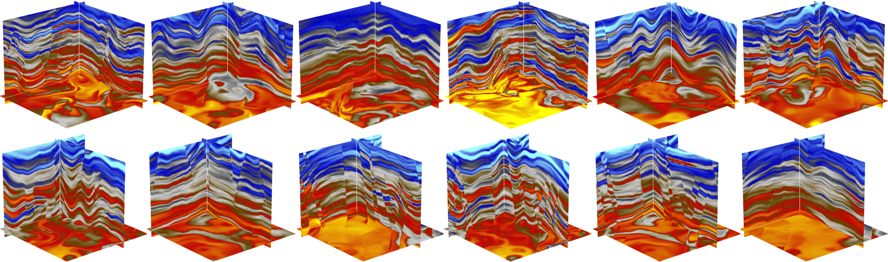
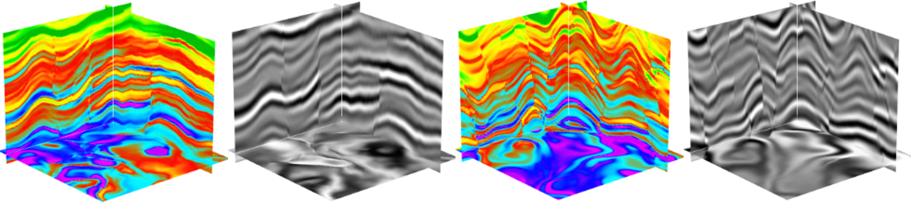
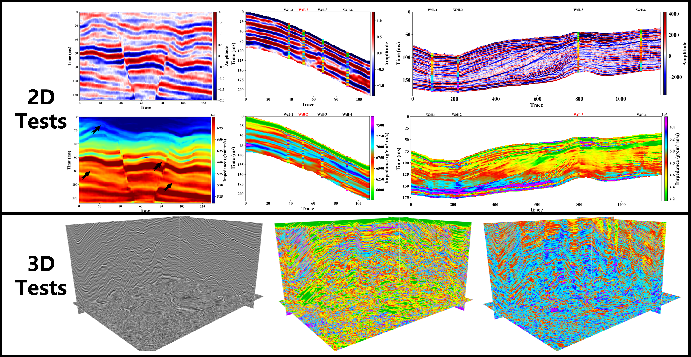

<div align="center">

# 🌍 GeoVolDiff
### Taming 3D Geological Volumes with Latent Diffusions

**From geological structures to training data for geophysics.**

[](https://arxiv.org/abs/2606.03572) [](https://huggingface.co/PangJiutian/geovoldiff) [](generate_data.ipynb) [](LICENSE)

[Overview](#overview) · [Getting Started](#getting-started) · [Generation](#generated-data) · [Inversion](#seismic-inversion)

<br>



<sub>3D geological volume generation with latent diffusion.</sub>

</div>


<a id="overview"></a>

## 🌍 Overview

**GeoVolDiff** aims to simplify complex geological modeling workflows while expanding the range of structures and conditions it can represent. Designed as a **training data generator for geophysics**, it produces controllable 3D geological volumes for downstream pretraining. We have demonstrated the effectiveness of the generated data in seismic inversion.

> **Actively evolving.** Model weights, conditioning inputs and generation examples will continue to be updated. See our [paper](https://arxiv.org/abs/2606.03572) for the current work; the next version is being prepared.

<a id="getting-started"></a>

## ⚡ Getting Started

```bash
git clone https://github.com/PangJiutian/geovoldiff.git
cd geovoldiff
pip install -r requirements.txt
```

A CUDA-capable GPU is recommended. Model weights and test data: [🤗 PangJiutian/geovoldiff](https://huggingface.co/PangJiutian/geovoldiff).

Place downloaded weights under `train_ckpt/`, set the model and label paths in **[generate_data.ipynb](generate_data.ipynb)**, and run the cells in order. The notebook covers configuration, data formats and visualization.

<a id="generated-data"></a>

## 🧊 Generated Data

<div align="center">



<br>

**Fault conditions → Geological volumes → Synthetic training pairs**

[Explore the generation notebook →](generate_data.ipynb)

</div>

<a id="seismic-inversion"></a>

## 🌊 Seismic Inversion

Generated data supports seismic inversion pretraining, providing geological structure priors for the downstream task.

<div align="center">



<sub>Downstream evaluation · Seismic inversion</sub>

</div>

---

<sub>
Licensed under <a href="LICENSE">Apache 2.0</a>. Parts of the model code are adapted from <a href="https://github.com/huggingface/diffusers">Hugging Face Diffusers</a>, with modifications noted in the source files.
</sub>

<div align="center">
<sub>Made for the geoscience community · More models, conditions and examples to come.</sub>
</div>
